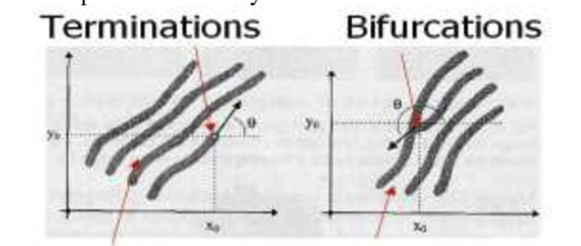
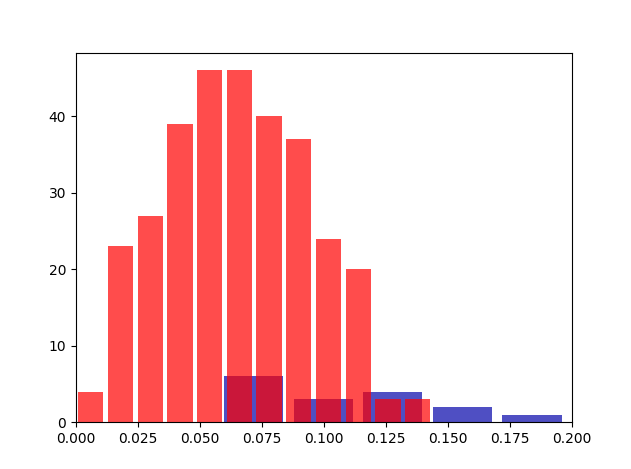

# Cryptography: Final Project

This repository implements the feature extraction of fingerprints data. 
The dataset utilized can be downloaded from here: https://www.dropbox.com/s/rbytme1jlu9z2sw/data.zip?dl=0

## Explanation of the Pipeline
Given a dataset of fingerprints, our goal is to extract _immutable_ features that allow us to recognize the identity of a fingerprint.
We want to detect two types of features from a fingerprint:
* Terminations
* Bifurcations

After detecting these two features onto a fingerprint, we can encode their coordinates into a binary string.
This binary string can be used as a encryption key.

It's clear that the robustness of this approach is only as good as the feature extraction algorithm. 
If a feature extraction method is perfect, any image transformation on an individual's fingerprint (e.g. rotation, scaling) would always yield the same features.
On the other hand if an algorithm is not solid enough, then rotating a fingerprint could change the amount of features found.
Of course, if the features found on multiple images of the same fingerprint are not consistent, the validity of this encryption method is compromised.

The steps of the algorithm are as follows:
1. We start by employing a **"fingerprint image enhancer"** algorithm; the rationale behind this decision is that we by upscaling the resolution of an image, the features are found more consistently.
2. On the enhanced images, we run our **"fingerprint feature extractor"** algorithm, to detect terminations and bifurcations.
3. For any given fingerprint image, for each pair of terminations/bifurcations, we apply the algorithm described in (https://cs.paperswithcode.com/paper/a-fingerprint-based-crypto-biometric-system) in section 2.1 to find the feature vectors V_P.
4. We turn the calculated features into a 15 bit-string.
5. After all the pairs of features are turned into 15 bit-strings, we calculate the resulting 2^15 bit-string vector that defines a fingerprint.
6. After these bit-strings are calculated for the whole dataset, we compare how _dissimilar_ the fingerprints are from each other by computing the hamming distance. Ideally, the same fingerprints on two images should have hamming distance of 0.
 
Since the bit-strings are going to have mostly 0s, we computed a _useful_ percentage for the hamming distance in the following way: 

Given:
* n1 = number of non zero features img 1
* n2 = number of non zero features img 2
* h = hamming distance

(n1 + n2 - h) / (n1 + n2)

The data utilized comes from http://bias.csr.unibo.it/fvc2002/databases.asp

## Explanation of the main.py file
All the steps described in the previous section were implemented into a class called FingerPrintAnalyzer.

Some methods are only used once for pre-processing:
* **apply_transformation**: for now it's a hard-coded function to apply a series of rotation to a fingerprint image and save the results. This is useful to test how transforming an image changes the detection of features.
* **enhance_and_save_images**: it loads the original images of fingerprints from the dataset and enhances them using a "fingerprint image enhancer" algorithm.
* **precalculate_features**: it calculates the features on the images and saves the coordinates into a dictionary file. The reason this method exists is because it's an operation that should only be done once, as it is computationally expensive.

How to run the script:
* **initialize_fingerprints_labels**: this is important to run in order to load the necessary information into the interpreter before running anything; it loads the features and the labels (e.g. if multiple images show the same fingerprint, then the label is the same for all of them).
* **analyze_fingerprints**: the main function that runs the pipeline.

Some other functions are private and only serve internal processing purposes (all the functions with the prefix "__").

## Results
After running the algorithm when focusing on comparing the fingerprint "data/DB1_B/101_1.tif" to all the others, it shows the following histogram of (percentage) hamming distances:

The red bars indicate how many samples had a different label, and the blue bars indicate the same fingerprint with different transformations.

## References
1. A fingerprint based crypto-biometric system for secure communication (2018)
2. https://github.com/Utkarsh-Deshmukh/Fingerprint-Feature-Extraction
   1. A minutiae-based matching algorithms in fingerprint recognition systems (2012)
   2. A Minutiae-based Fingerprint Matching Algorithm Using Phase Correlation (2007)
3. Fingerprint Recognition Using Minutia Score Matching (2009)
4. https://github.com/Utkarsh-Deshmukh/Fingerprint-Enhancement-Python
   1. Fingerprint image enhancement: Algorithm and performance evaluation (1998)
5. Fuzzy logic method for partial fingerprint recognition (2012)
6. https://www.kaggle.com/code/dijorajsenroy/fingerprint-feature-extraction-for-biometrics/notebook
   1. A Comparison of various Edge Detection Techniques used in Image Processing (2012)

